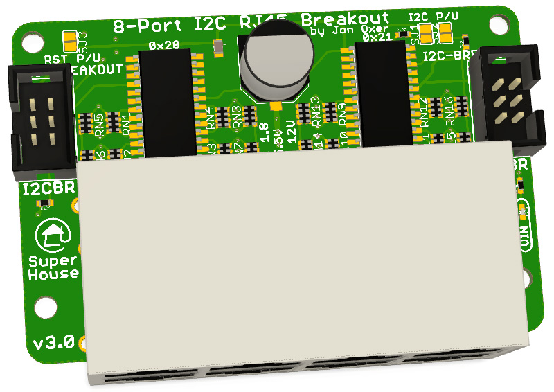
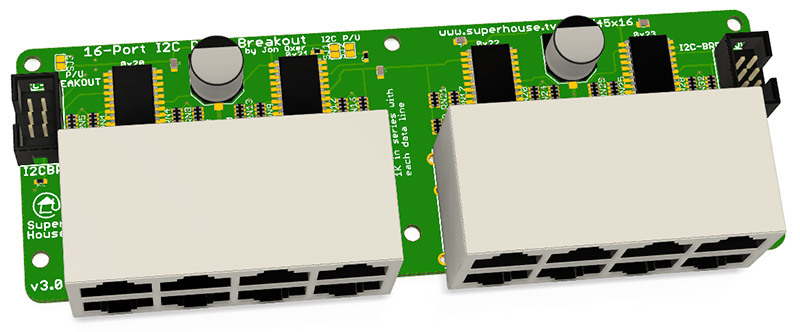
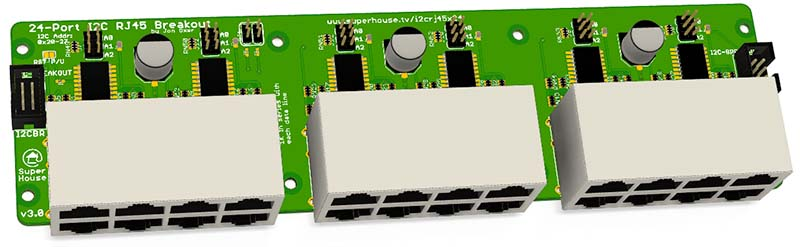

I2C to RJ45 Breakouts for Light Switch Controller
=================================================

Copyright 2019-2021 SuperHouse Automation Pty Ltd  www.superhouse.tv

These I2C to RJ45 breakouts are one component of the SuperHouse home
automation light switch controller project. They allow light switches
to be connected to a controller such as an Arduino, Raspberry Pi,
or ESP8266/ESP32 board.

The RJ45 sockets on the breakout are connected to I/O channels via
I2C addressable I/O buffers. Each RJ45 socket provides connections for
GND, 12V, and 4 signal lines.

Features:

 * RJ45 sockets for connection to light switches over Cat-5
 * I2C interface with interrupt output

More information on the Light Switch Controller project:

  http://www.superhouse.tv/lsc

The LSC also has its own GitHub repo which includes example firmware:

  https://github.com/SuperHouse/LSC

Purchase these breakouts pre-assembled:

  http://www.superhouse.tv/i2crj45

INSTALLATION
------------
The design is saved as an EAGLE project. EAGLE PCB design software is
available from www.cadsoftusa.com free for non-commercial use. To use
this project download it and place the directory containing these files
into the "eagle" directory on your computer. Then open EAGLE and
navigate to the project.

CREDITS
-------
Designed by Jonathan Oxer jon@oxer.com.au

DISTRIBUTION
------------
The specific terms of distribution of this project are governed by the
license referenced below.

LICENSE
-------
Licensed under the TAPR Open Hardware License (www.tapr.org/OHL).
The "license" folder within this repository also contains a copy of
this license in plain text format.
